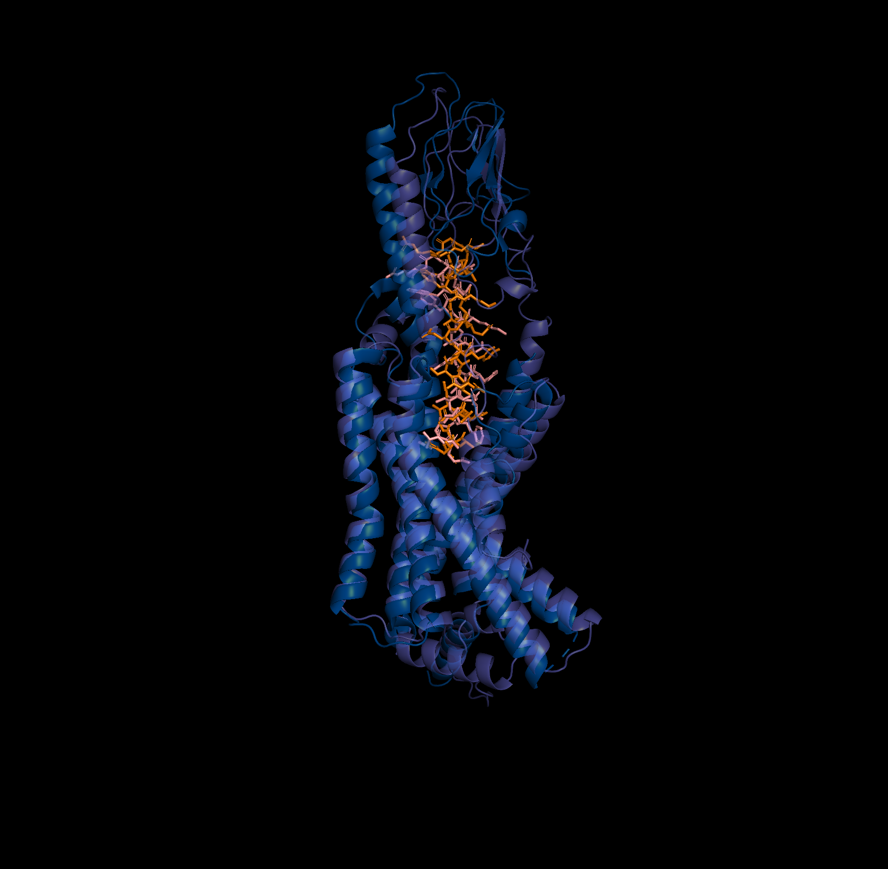
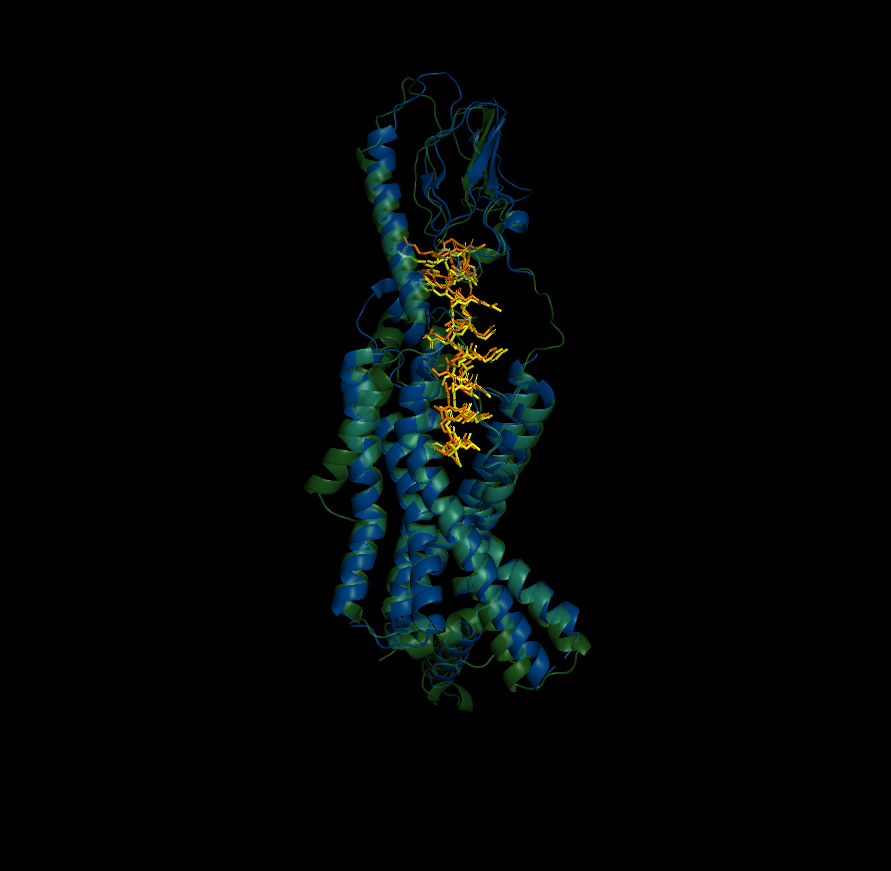
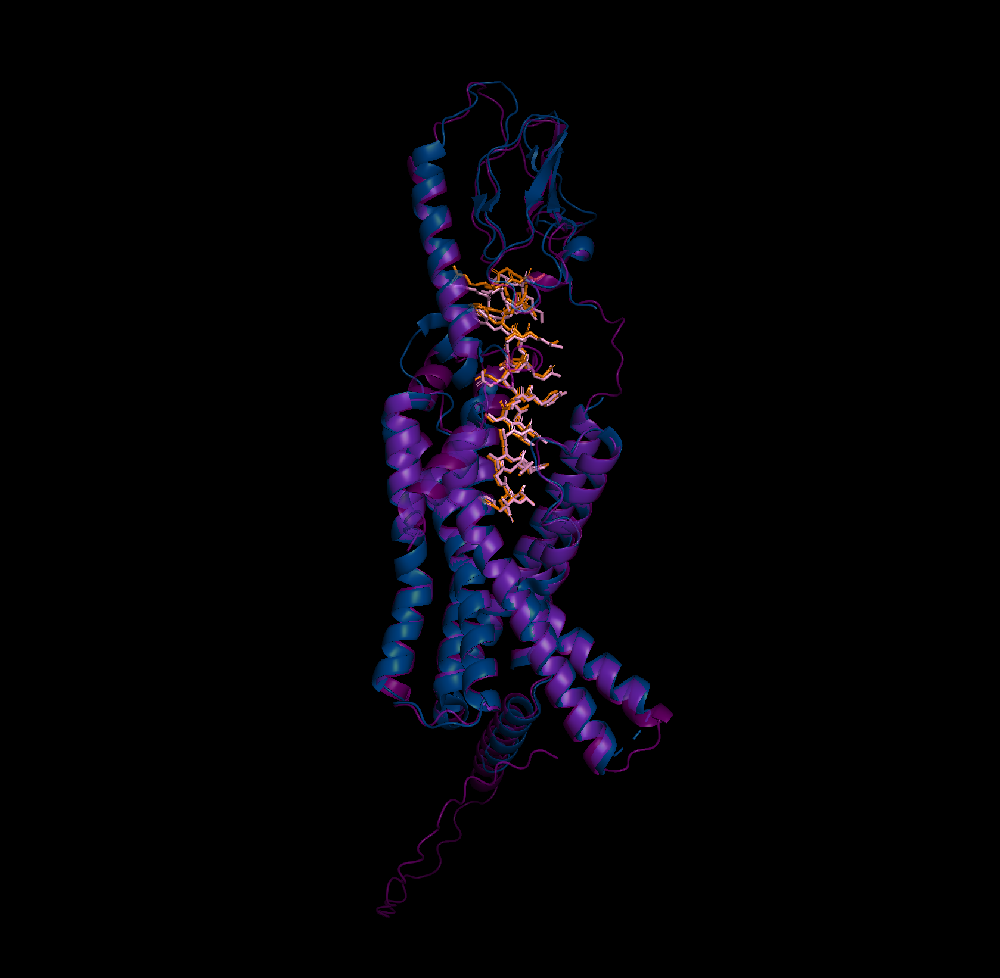

# wip

Comparative analysis of protein-ligand complex structures predicted by different AI methods using GLP1R as a model system. Prediction pipelines, analysis scripts, and visualization tools for benchmarking AI structure prediction methods.

## Example predictions of GLP-1R (protein) and GLP-1 (ligand) complex: Chai-1, Boltz-1, AlphaFold3, and AlphaFold2
### Chai-1 prediction on PDB 6X18

    
    

__Chai-1 prediction on PDB 6X18: RMSD 2.834, TM-score x, lDDT x.__

### Boltz-1 prediction on PDB 6X18

    
    

__Boltz-1 prediction on PDB 6X18: RMSD 1.361, TM-score x, lDDT x.__

### AlphaFold3 prediction on PDB 6X18

    
    

__AlphaFold3 prediction on PDB 6X18: RMSD 0.895, TM-score x, lDDT x.__

### AlphaFold2 prediction on PDB 6X18 (receptor only for AF2 structure)

    
    

__AlphaFold2 prediction (receptor only) on PDB 6X18: TM-score x, lDDT x.__