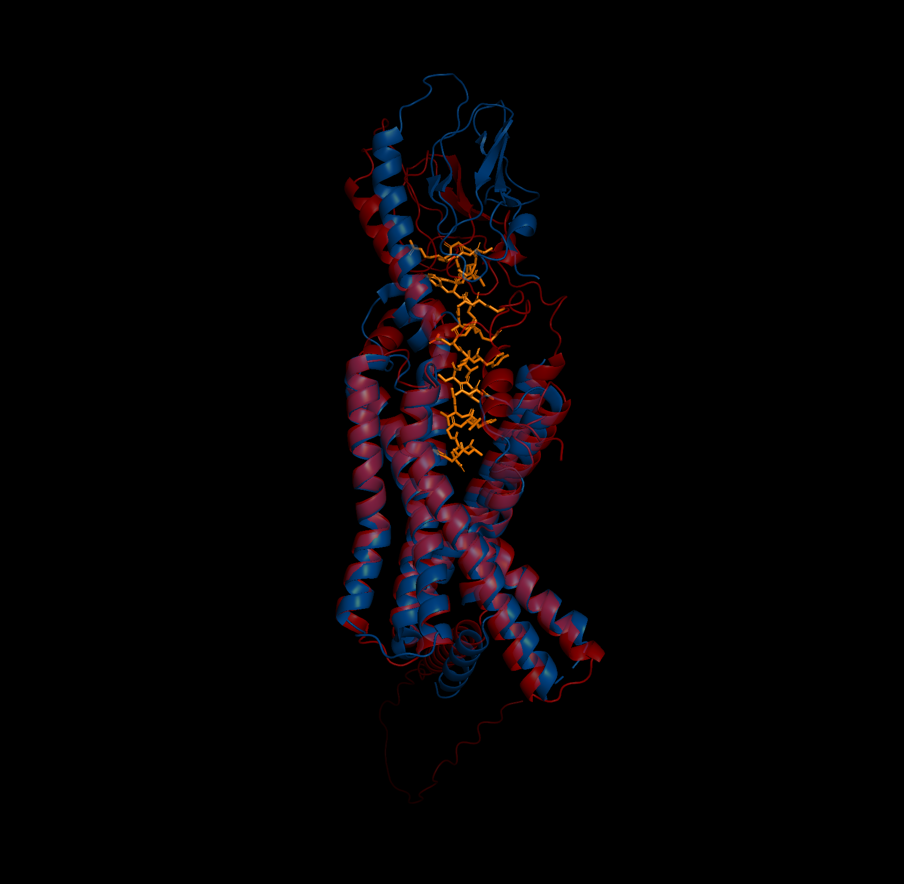

# AI Structure Prediction Comparison

Comparative analysis of protein-ligand complex structures predicted by different AI methods using GLP1R as a model system. Prediction pipelines, analysis scripts, and visualization tools for benchmarking AI structure prediction methods.

## Project Overview

This project was initiated to:
1. Gain hands-on experience with state-of-art protein structure prediction methods
2. Compare different AI methods' capabilities in predicting protein-ligand complexes
3. Create a reproducible visualization and analysis pipelines
4. Understand the strengths and weaknesses of various prediction pipelines
5. Develop a systematic approach to evaluate prediction quality (RMSD, TM-score, lDDT-PLI)

As a first foray into using these methods, I used GLP-1R (Glucagon-like peptide-1 receptor) and its ligand GLP-1. 

## Example predictions of GLP-1R (protein) and GLP-1 (ligand) complex: Chai-1, Boltz-1, AlphaFold3, and AlphaFold2
### Chai-1 prediction on PDB 6X18
<div style="display: flex; gap: 20px;">
    
    
</div>

**Chai-1 prediction on PDB 6X18: RMSD 2.834, TM-score 0.256, lDDT-PLI 0.367.**

### Boltz-1 prediction on PDB 6X18
<div style="display: flex; gap: 20px;">
    
    
</div>

**Boltz-1 prediction on PDB 6X18: RMSD 1.361, TM-score 0.244, lDDT-PLI 0.376.**

### AlphaFold3 prediction on PDB 6X18
<div style="display: flex; gap: 20px;">
    
    
</div>

**AlphaFold3 prediction on PDB 6X18: RMSD 0.895, TM-score 0.245, lDDT-PLI 0.340.**

### AlphaFold2 prediction on PDB 6X18 (receptor only for AF2 structure)
<div style="display: flex; gap: 20px;">
    
    
</div>

**AlphaFold2 prediction (receptor only) on PDB 6X18: TM-score 0.255.**


## Interpretation of Results
- **RMSD (Root Mean Square Deviation)**: Measures average deviation in atomic positions between a predicted and reference structure after optimal superposition.Lower values indicate closer structural alignment (values closer to 0), but RMSD can be influenced by structural shifts and often doesn't reflect functional similarity
- **TM-score**: Evaluates global fold similarity (0-1 scale, >0.5 typically indicates similar fold). Unlike RMSD, TM-score is less sensitive to local fluctuations and more accurately reflects overall topology
- **lDDT-PLI (Local Distance Difference Test for Protein-Ligand Interactions)**: Evaluates local accuracy and confidence in protein-ligand binding interface by comparing interatomic distances in predicted and reference structures (1 is perfect). Focuses more on binding interaction and is independent on global superposition

## Key Findings
1. **AF3** shows the best RMSD (0.895Å), suggesting highest structural accuracy to PDB 6X18
2. **TM-scores** are similar across methods (~0.24-0.26), suggesting comparable folds
3. **lDDT-PLI** values are also similar across methods (0.340-0.376), suggesting comparable binding interface accuracy
4. **AF2** can only predict the receptor structure, limiting its use for protein-ligand complexes

## Metric Limitations and Interpretation Challenges
1. **RMSD**:
- Sensitive to outliers and global alignment
- Depends on alignment method used (e.g. superimposing on the reference structure with something like PyMOL vs. aligning to the reference structure)
- A low RMSD doesn't necessarily mean the structure is accurate, or indicate good binding interaction
- Needed careful consideration of:  
    - Which atoms to use for alignment (i.e. CA vs all atoms)
    - Handling receptor-peptide alignment separately or together
    - Dealing with different chain identifiers 

2. **TM-score**:
- TM-scores below 0.4 generally indicate weak structural similarity, so the low scores here suggest that no predictor fully captured the experimental complex
- The scores of ~0.24-0.26 suggest:
    - Potential limitations in predition methods
    - Potential limitations with structure alignment
    - Need for careful interpretation of global similarity metrics

3. **lDDT-PLI**:
- Threshold selection:
    - What are good cutoff distances for determining lDDT-PLI/how strictly should we evaluate atomic distance deviations? 
        - Smaller cutoffs will enforce strict atomic accuracy, while larger cutoffs may be better for accounting for natural structural variation in protein-ligand complexes
        - Differnet systems need different thresholds:
            - Protein-protein vs. protein-ligand
            - Large vs small molecules
            - Rigid vs flexible molecules

## General Considerations
- No single metric captures the prediction quality
- Different metrics may apply to different research questions
    - Current project used simplified thresholds
- Structural metrics ≠ functional metrics

## What now?

### Need for streamlined benchmarking tools
- Current landscape lacks clear guidance for metric selection, and different questions require different evaluation metrics
     ```
     If predicting single protein structure:
        → RMSD, TM-score sufficient
     If protein + ligand:
        → Add interface-specific metrics (lDDT-PLI)
        → Consider pocket-specific measures
     If protein complex:
        → Add interface contact analysis
        → Consider symmetry measures
     If membrane protein:
        → Add membrane orientation metrics
        → Consider lipid interactions
     ```

### From Structure to Function

**Structure vs. Binding**
- Need to bridge gap between:
    - Static structure analysis
    - Dynamic binding events
    - Affinity predictions

**Last Thoughts**

This project exposed an endless list of additional questions, but I chose not to get lost in the details. While structural accuracy is important, my natural curiousity points me in the direction of drug discovery and a more practical evaluation of drug-target interactions. While a lot of these tools produce accurate binding poses, there seems to be a lack of integrated workflows that streamline the entire molecular docking process.  I also realized how computationally expensive and slow these processes can be: can real-time complex predictions be integrated while optimizing docking simulations?
The next project will focus on:
- Predicting protein-ligand binding affinities
- Real-time complex predictions
- Integration with Boltz-1 framework

